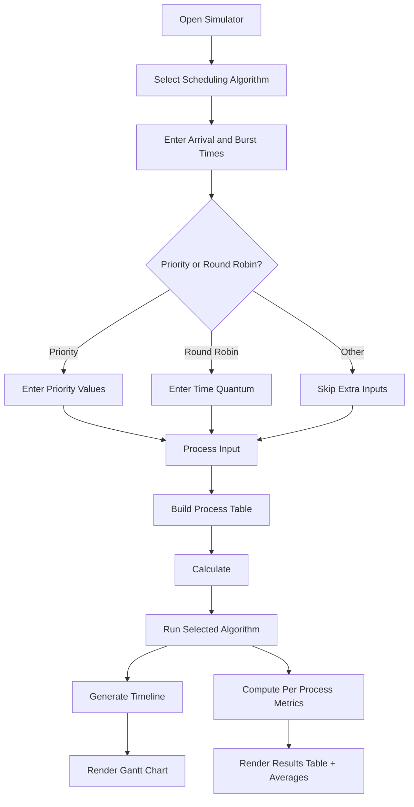
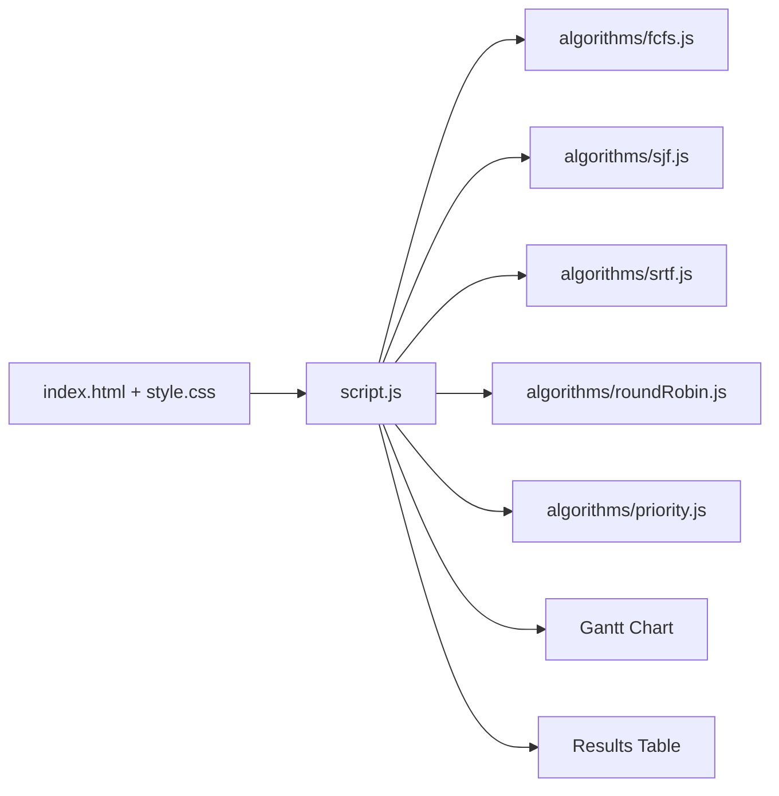

# CPU Scheduler

I built this CPU Scheduling Simulator as a clean and visual way to practice scheduling logic from Operating Systems. You can add process inputs, pick an algorithm, and instantly view both the Gantt chart and timing metrics.

## Live website

- https://syllabuscal.ranjansharma.info.np

## What this project does

This simulator supports:
- First Come First Served (FCFS)
- Shortest Job First (SJF, non preemptive)
- Shortest Remaining Time First (SRTF, preemptive)
- Round Robin (with time quantum)
- Priority Scheduling (non preemptive and preemptive)

For each run, it calculates:
- Completion Time
- Turnaround Time
- Waiting Time
- Response Time
- Average values for the metrics above

## Tech stack

- HTML
- CSS
- Vanilla JavaScript (ES modules)

## How the app flows



## Project diagram



## Input format

Use space separated values.

Examples:
- Arrival Times: `0 1 2 3`
- Burst Times: `3 6 4 5`
- Priority Values: `2 1 4 3`
- Time Quantum: `2`

## Run locally

1. Clone the repository
   ```bash
   git clone https://github.com/Konseptt/CPU-scheduler.git
   ```
2. Open the project folder
3. Open `index.html` in your browser

No build step is required.

## Notes

- The simulator includes a light and dark mode toggle.
- Theme preference is saved in local storage.
- Idle CPU time appears in the Gantt chart when no process is available.

## Repository metadata

Repository settings are defined in:
- `.github/settings.yml`

This includes:
- Description
- Website
- Topics
